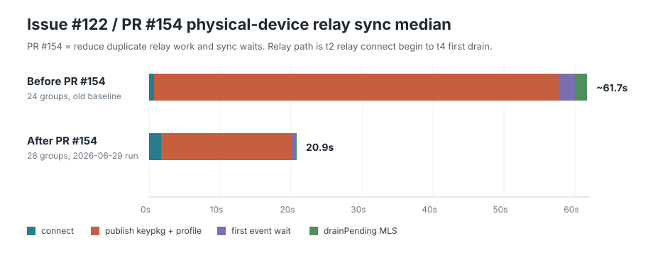

# Performance: cold-start, relay-sync, message-send, and sticker-cache benchmarks

Status: harnesses implemented under `scripts/bench/`; native Apple and Compose
Multiplatform app surfaces supported.
Last updated: 2026-07-14.

Reproducible measurement of how long a **cold start** of the iOS Sonar app takes
to become usable and to finish its first **Nostr/Marmot relay sync**, broken down
by phase. Built to investigate "slow to sync / slow to send" by showing *where*
the startup time actually goes, in line with the Signal-Comparable Performance
Rule (local-first paint, sync in the background).

This document covers **two benchmark tracks**:

- **Device latency** (most of this doc): how fast a real phone starts, syncs, and
  sends. Device- and network-bound; timings are the point.
- **Protocol scale** ([`## Protocol scale benchmark`](#protocol-scale-benchmark-sonar-sim)
  below → full detail in [`GROUP-SCALE-SIM.md`](GROUP-SCALE-SIM.md)):
  device-independent structural limits of the MLS/Marmot group protocol — the
  real group-size ceiling, welcome/commit growth, fork behavior. Run this when
  you **bump the MDK rev** or change the welcome/commit path, to get before/after
  numbers on the protocol itself.

## What it measures

The app emits `SONAR_BENCH` markers to the unified log (`SecureLogger.info`,
subsystem `chat.bitchat`, category `session`). The harness cold-starts the app
repeatedly — terminate the process, relaunch; the container is **never erased**,
so the identity + Marmot groups persist — and diffs the marker timestamps.

| marker | site | meaning |
|---|---|---|
| `t0_launch` | `BitchatApp.init` | app process entered `init()` — earliest in-process point |
| `t1_local_paint` | `MarmotChatModel.performConnect` | local groups hydrated from the encrypted DB (first paint, no relays) |
| `t2_relay_connect_begin` | `MarmotChatModel.connectRelaysIfNeeded` | relay attach begins |
| `t3_relay_connected` | `MarmotChatModel.connectRelaysIfNeeded` | relays quorum-connected (`SonarNode.connect` returned) |
| `t3a_published` | `MarmotChatModel.connectRelaysIfNeeded` | KeyPackage + profile publish ENQUEUED: events are created/persisted and the relay sends run in the background inside the core (`publish_*_background`). Before 2026-07, this marker measured the blocking relay OK waits (~18-57 s on device); `startPolling()` now starts BEFORE the publishes, so t3a no longer gates the drain loop |
| `t3b_first_wake` | `MarmotChatModel.startPolling` | first `waitForMarmotEvent` returned (splits wait vs drain) |
| `t4_first_drain` | `MarmotChatModel.startPolling` | first relay event burst applied to local storage (initial sync produced data) |

Reported phases: `launch→t0` (process + SwiftUI init), `t0→t1` (open DB + local
paint), `t1→t2` (local-first pre-relay delay), `t2→t3` (relay quorum connect),
`t3→t4` (initial sync drain), plus totals `launch→t4` (cold → synced) and
`t0→t4`.

`t4` carries `woke=`/`notif=`: `woke=1` means the relay replayed stored group
events (the real re-sync path); `woke=0 notif=0` means nothing new to sync — in
that case `t3→t4` is just the 25 s `waitForMarmotEvent` idle wait, **not** sync
cost.

## The harness (`scripts/bench/`)

- `build-sim.sh` — Debug, arm64, **unsigned** build; prints the `.app` path.
- `cold-start-bench.sh` — terminate→relaunch loop; parses the markers; prints a
  per-phase min/median/max table. Stands alone (freshly-generated identity →
  `woke=0`, useful for the identity-independent phase breakdown).
- `provision-and-bench.sh` — the faithful "existing account, cold process" run.
  Uses `sonar-cli` as a headless counterparty to seed a real 1:1 Marmot group
  and push fresh messages before each run → `woke=1` real re-sync.
- `_aggregate.py` — shared parser/aggregator.
- `device-bench.sh` — the same benchmark on a PHYSICAL iPhone against the REAL
  account (real chats). Properly signed → Keychain works, no env hooks. Installs
  over the existing app (data preserved), cold-starts via `devicectl`, captures
  markers via `idevicesyslog -m SONAR_BENCH`, and parses the device-local
  `[HH:MM:SS.mmm]` BitLogger timestamps. Splits the post-connect window into
  publish / wait / drain via the `t3a`/`t3b` markers.
- `README.md` — usage + design notes.
- `_sticker_aggregate.py` — cross-platform sticker pack/image benchmark parser.
  It reports relay metadata fetch, HTTPS miss phases, verified disk/reference
  hits, detached prefetch completion, and the observed network-to-cache speedup.

## How to run

```bash
# one time
core/build-ios.sh                      # Rust core → sonarffi.xcframework (incl. sim slice)
cargo build -p sonar-cli --release     # headless counterparty
APP=$(scripts/bench/build-sim.sh)      # Debug build → prints Sonar.app path

# quick: phase breakdown, freshly-generated identity (woke=0)
scripts/bench/cold-start-bench.sh --app "$APP" --runs 5

# faithful: existing account re-syncing real messages (woke=1)
scripts/bench/provision-and-bench.sh --app "$APP" --runs 5 --msgs-per-run 3
```

Raw per-run logs land in `/tmp/sonar-bench/runs/run_*.ndjson`.

## Design notes / gotchas

- **Debug build required** — `SecureLogger` only logs `%{public}@` (readable in
  the unified log) in DEBUG; Release renders the markers as `<private>`.
  Physical-device builds must also compile the local `BitLogger` Swift package
  with the DEBUG conditional. If `idevicesyslog -m SONAR_BENCH` sees no markers
  while the strings are present in the app binary, rebuild with
  `OTHER_SWIFT_FLAGS='-DDEBUG'`.
- **arm64-only** — the Arti (`libarti_bitchat.a`) and `sonarffi` simulator slices
  are arm64 (Apple Silicon); `generic/platform=iOS Simulator` also tries x86_64
  and fails to link. The build pins `ARCHS=arm64`.
- **Unsigned + Keychain-independent bench path.** CLI builds of this app sign
  ad-hoc with empty entitlements (the `sh.hedwig.sonar` bundle id is Hedwig's
  team; a local personal team can't provision it), so Keychain returns
  `errSecMissingEntitlement` (-34018) and `performConnect` would early-return
  before the relay-sync path ever starts. Re-signing breaks launch ("denied by
  service delegate"). So the benchmark provisioning path is **Keychain-free**
  (all `#if DEBUG` + gated on the `SONAR_BENCH_NSEC` env var):
  - `BitchatApp.init` force-completes onboarding so the connect path runs headless.
  - `MarmotChatModel.performConnect` adopts the env identity directly.
  - `MarmotService.databaseConfig` derives the encrypted-DB key as `SHA256(nsec)`
    — stable across runs, so the existing-account DB persists.
  These hooks are inert in normal use and impossible in Release.
- **Env passing** — `simctl launch` forwards `SIMCTL_CHILD_<NAME>` to the app.
- **`log show` hides info-level** without `--info`; the harness streams with
  `log stream --level debug`.
- **Auto-join** — DMs (Marmot member_count ≤ 2) auto-join on the recipient
  (`core/sonar-core/src/marmot.rs::process_incoming`), so seeding a group needs
  no UI interaction. Multi-member groups would need explicit accept.
- **`sonar-cli init --force`** rewrites `config.json` (new DB key) but not the old
  encrypted `marmot.sqlite` → "Wrong encryption key"; wipe the agent home first
  (the provision script does this).

## Sticker pack/cache device benchmark

Sticker timing is emitted by the shared core, so the same phase definitions are
used on native Apple and Compose devices. The explicit Debug-only device
launcher temporarily enables debug-level `SONAR_BENCH` telemetry, exercises the
same foreground ladder on each platform, and restores the user's diagnostics
setting when it completes:

```bash
scripts/bench/_sticker_aggregate.py --label 'iPhone' /tmp/iphone-stickers.log
scripts/bench/_sticker_aggregate.py --label 'Android' /tmp/android-stickers.log
```

The headline comparison is HTTPS image total versus verified disk hit and
validated transcript hit (median and p95). Pack metadata relay time and the
first-20/four-task prefetch batch are reported separately so relay variability
is not mistaken for filesystem/cache cost. Exact capture commands and marker
fields are documented in `scripts/bench/README.md`. The parser requires exactly
one completed device batch, proves the final durable pass used verified disk
hits, and validates its success and marker schema so an incomplete or mixed
capture cannot silently produce misleading numbers.

Pack metadata refresh remains network-first. If that refresh is unavailable,
the shared core falls back to its last cryptographically validated local pack
definition instead of failing the picker/benchmark; `source=network` and
`source=fallback_disk` keep those timing populations separate. A concurrent
caller that joins the same in-flight request is reported as `source=shared`.

Physical Apple and Android builds also expose an explicit Debug-only launcher
benchmark. It drives the real production cache ladder (initial image load →
host LRU → verified disk → validated transcript lookup) without installing a
pack, clearing an account, or changing a conversation. This is the preferred
per-device comparison because the same public pack and image count can be used
on both devices; the initial pass itself reports whether that device was cold
(`source=network`) or already warm (`source=disk`).

### Physical-device result — 2026-07-14

Live public pack: `Herecomesbitcoin.org`, 103 stickers. These are observational
device samples, not CI thresholds; relay and HTTPS time include current network
conditions.

| device/path | n | median | p95 | notes |
|---|---:|---:|---:|---|
| Pixel 10 Pro relay pack refresh | 1 | 10,023.5 ms | 10,023.5 ms | same 8-image offset-60 ladder |
| Pixel 10 Pro validated pack fallback | 1 | 1.25 ms | 1.25 ms | intentionally unavailable loopback relay |
| Pixel 10 Pro verified disk hit | 16 | 0.93 ms | 2.63 ms | 8 initial + 8 post-memory reads |
| Pixel 10 Pro host LRU hit | 8 | 0.001 ms | 0.01 ms | 8/8 successful |
| Pixel 10 Pro validated transcript hit | 8 | 1.43 ms | 2.85 ms | 8/8 coordinate + shortcode + SHA authorizations |
| iPhone 14 Pro Max relay pack refresh | 1 | 229.9 ms | 229.9 ms | same 8-image offset-60 ladder |
| iPhone 14 Pro Max verified disk hit | 16 | 0.92 ms | 1.70 ms | 8 initial + 8 post-memory reads |
| iPhone 14 Pro Max host LRU hit | 8 | 0.005 ms | 0.009 ms | 8/8 successful |
| iPhone 14 Pro Max validated transcript hit | 8 | 1.09 ms | 1.32 ms | 8/8 successful |

Every reported ladder completed with matching initial/memory/disk/reference
counts. Both devices were warm for the final matched run: the iPhone's existing
account already had offsets 0, 20, 40, and 60 of the public pack, and the Pixel
had the selected offset-60 images from its earlier smoke run. No honest cold
HTTPS sample was available without deleting user cache data; the benchmark
preserved that data.
Fresh offset-68/80 download attempts encountered unavailable public image
responses after pack fetch and were rejected by the completeness checks rather
than being reported as performance samples.

Pack metadata remains network-bound and variable (229.9 ms–10.02 s in the final
matched-device run), while the forced validated-local fallback completed in
1.25 ms on Pixel. The cache itself is not the bottleneck. This change therefore keeps a
25 MiB/100-entry host LRU on each app
surface, a verified content-addressed disk cache with a strict 5 MiB per-image
foreground/prefetch limit, shared per-pack/per-SHA single-flight fetch gates,
and bounded first-20/four-task install prefetch detached from the UI/FFI path.
Identity replacement and wipe first stop new sticker work and drain active
reads on Apple, Android, and desktop before deleting the database/cache. When a
relay refresh fails, every host now receives the persisted validated pack
metadata rather than losing an otherwise usable warm cache. Moving refresh fully
behind the first local paint remains a separate UI lifecycle optimization.

## Baseline result

Median of 5 cold starts · iPhone 16 Pro simulator · existing account with 1
Marmot group · live relays · `woke=1` every run:

| phase | median |
|---|---|
| launch → t0 (process + SwiftUI init) | 312 ms |
| t0 → t1 (open DB + local paint) | 194 ms |
| t2 → t3 (relay quorum connect) | 133 ms |
| **t3 → t4 (initial sync drain)** | **917 ms** |
| **TOTAL launch → t4 (cold → synced)** | **≈ 1.55 s** |

(`t1→t2` is effectively zero here — see findings.)

## Device result (real account — the real pain point)

Median of 4–5 cold starts · iPhone 14 Pro Max · **real account with 24 Marmot
groups** · live relays · every run `woke=1 notif=0`:

| phase | median |
|---|---|
| t0 → t1 (open DB + local paint, 24 groups) | ~1.3 s |
| t2 → t3 (relay quorum connect) | ~0.7 s |
| **t3 → t3a (publish KeyPackage + profile)** | **~57 s** |
| t3a → t3b (first event wait) | ~2.3 s |
| t3b → t4 (`drainPending` MLS processing) | ~1.7 s |
| **TOTAL t0 → t4 (cold → synced)** | **~52–66 s** |

**Root cause — blocking relay publishes on the cold-start critical path.**
`MarmotChatModel.connectRelaysIfNeeded` does `try? await publishKeyPackage()`
then `try? await publishProfile()` **before** `startPolling()`. Both call the
core `publish_key_package`/`publish_profile` → `nostr.send_event(...).await`,
which **waits for relay acknowledgement** across all 5 relays (the core itself
notes at `client.rs:2706` that `send_event()` awaits a relay OK and should be
backgrounded). With a slow/unreachable relay this stalls ~28 s per publish, so
the sync loop doesn't start for ~57 s. The actual sync/drain is **fast (~1.7 s)**
— the time is almost entirely the two publishes, not message processing.

This explains BOTH symptoms: incoming messages aren't drained until the publishes
finish ("slow to sync"), and message sends use the same await-all-relays
`send_event` path ("slow to send").

## Issue #122 / PR #154 result (physical iPhone, after relay fixes)

Run on 2026-06-29 with `scripts/bench/device-bench.sh`, `RUNS=5`,
`TIMEOUT=180`, after PR #154 ("reduce duplicate relay work and sync waits"),
with a signed Debug build installed over the existing app so real account data
was preserved. All 5 runs reached `t4_first_drain`; every run had `woke=1
notif=0`.

This is not a perfectly controlled hardware/account comparison: the old device
baseline used 24 Marmot groups and this run used 28 groups. It is still the
right comparison for the reported pain point because both measurements use the
physical-device real-account path and preserve local app data.



Median of 5 cold starts · physical iPhone · **real account with 28 Marmot
groups** · live relays:

| phase | before PR median | after PR median | delta |
|---|---:|---:|---:|
| t0 → t1 (open DB + local paint) | ~1.3 s | 2.440 s | +1.140 s |
| t2 → t3 (relay quorum connect) | ~0.7 s | 1.711 s | +1.011 s |
| **t3 → t3a (publish KeyPackage + profile)** | **~57 s** | **18.327 s** | **~38.7 s faster** |
| t3a → t3b (first event wait) | ~2.3 s | 0.613 s | ~1.7 s faster |
| t3b → t4 (`drainPending` MLS processing) | ~1.7 s | 0.229 s | ~1.5 s faster |
| **relay path t2 → t4** | **~61.7 s** | **20.880 s** | **~40.8 s faster** |
| **TOTAL t0 → t4 (cold → synced)** | **~52–66 s** | **23.958 s** | **~28–42 s faster** |

Full after-PR min/median/max table:

| phase | min | median | max |
|---|---:|---:|---:|
| t0 → t1 (open DB + local paint) | 1.859 s | 2.440 s | 3.737 s |
| t1 → t2 (pre-relay window) | -0.160 s | -0.114 s | -0.025 s |
| t2 → t3 (relay quorum connect) | 1.132 s | 1.711 s | 1.993 s |
| t3 → t3a (publish KeyPackage + profile) | 13.608 s | 18.327 s | 21.206 s |
| t3a → t3b (first event wait) | 0.201 s | 0.613 s | 0.753 s |
| t3b → t4 (`drainPending` MLS processing) | 0.012 s | 0.229 s | 0.705 s |
| **TOTAL t0 → t4 (in-app → synced)** | **18.957 s** | **23.958 s** | **25.759 s** |

The PR materially improves the real-device pain point: the relay path drops from
roughly 62 s to 21 s median, and total in-app cold-start-to-synced drops to
about 24 s. The remaining dominant cost is still `t3 → t3a`: publishing the
KeyPackage and profile takes ~18.3 s median and accounts for about 88% of the
post-connect relay path after the PR.

> **Baseline comparability note (2026-07):** `t3a_published` was REDEFINED when
> the publishes moved to the background (`publish_*_background`): it now marks
> publish enqueue (event created/persisted), not relay OK acks. `t3→t3a`
> numbers in the tables above measure the OLD blocking semantics and are not
> directly comparable with newer runs; `startPolling()` also no longer waits
> for t3a, so first-drain timings improved independently of publish latency.

## PR #220 replacement: text-send latency evaluation

Run on 2026-07-13/14 for the replacement of accidentally merged PR #220. Each
surface sent **50 accepted text messages** to the same Sonar agent DM using a
signed Debug build and the account's live relay set. An accepted sample has
both `send_local_pending local_ms=` and `send_first_ack rtt_ms=` for the same
message ID; UI actions that never reached the shared core are not samples.
Overlapping device-log snapshots are deduplicated by message ID.

The baseline already includes PR #220's local-first durable outbox, per-relay
fan-out, first-ACK delivery state, and content-free timing markers. In that
build, best-effort push notification events started concurrently with the
encrypted message. The optimized build gives content priority: push work waits
until the message receives its first relay ACK, or until every content publish
attempt has finished. The UI still returns immediately after the durable local
pending write is queued: its optimistic row paints immediately, and neither
relay ACKs nor push work gate transcript paint.

Devices and automation:

- **macOS native:** signed SwiftUI Debug app using the explicit environment
  trigger documented in `scripts/bench/README.md`.
- **iPhone:** iPhone 14 Pro Max (`Vincenzo`), iOS 26.5, CoreDevice over Wi-Fi,
  using the same Debug trigger. The task temporarily disables idle sleep and
  restores it after the final queued send; XCTest is not required.
- **Android:** Pixel 10 Pro over USB, automated with ADB/UIAutomator against the
  Compose app.

The final macOS and iPhone rows below were rerun after rebasing onto
`origin/main` at `9ca6a25c`. The Pixel optimized row was captured immediately
before that rebase. The only new base commit was web-only PR #238, and the
post-rebase Compose `assembleDebug` reported all 46 APK inputs/tasks up to date,
so the Android send binary was unchanged. The Pixel was no longer connected
when the post-rebase repeat was attempted; this limitation is recorded rather
than presenting an unexecuted run as fresh data.

All values are milliseconds. `total` is the sum of the sequential local-persist
and publish-to-first-ACK phases, not a host wall-clock timestamp.

| surface | run | accepted / observed | failure-marked | local persist min / median / p95 / max | first ACK min / median / p95 / max | total min / median / p95 / max |
|---|---|---:|---:|---:|---:|---:|
| macOS native | concurrent-push baseline | 50 / 54 | 0 | 7 / 9 / 20 / 58 | 18 / 20 / 44.6 / 59 | 26 / 30 / 65.6 / 78 |
| macOS native | content-first + bounded refresh | 50 / 50 | 0 | 7 / 21.5 / 39.1 / 52 | 18 / 24 / 31 / 50 | 27 / 45.5 / 65.1 / 77 |
| iPhone 14 Pro Max | concurrent-push baseline | 50 / 50 | 13 | 10 / 31 / 42 / 43 | 20 / 24 / 2181 / 2182 | 36 / 64 / 2191.6 / 2209 |
| iPhone 14 Pro Max | content-first + bounded refresh | 50 / 50 | 0 | 10 / 38.5 / 43 / 45 | 20 / 24 / 44.9 / 71 | 33 / 61.5 / 76.1 / 89 |
| Pixel 10 Pro | concurrent-push baseline | 50 / 50 | 0 | 32 / 66.5 / 87.6 / 134 | 37 / 212.5 / 471.6 / 829 | 78 / 282.5 / 542.1 / 893 |
| Pixel 10 Pro | content-first optimized | 50 / 51 | 0 | 30 / 60.5 / 89.5 / 98 | 22 / 31 / 54.3 / 59 | 59 / 98 / 124.6 / 133 |

The Pixel result is the clearest improvement: median first-ACK latency fell
from 212.5 ms to 31 ms (**85.4% faster**) and median local-to-ACK total fell
from 282.5 ms to 98 ms (**65.3% faster**). Its first-ACK p95 fell from 471.6 ms
to 54.3 ms (**88.5% faster**).

The iPhone first-ACK median remained 24 ms, but its first-ACK p95 fell from
2181 ms to 44.9 ms (**97.9% faster**) and total p95 fell from 2191.6 ms to
76.1 ms (**96.5% faster**). Failure-marked samples fell from 13 to zero. This
removes the long user-visible `Sending` tail that motivated the device run;
median total also improved from 64 ms to 61.5 ms.

The device run also exposed a separate native UI stall: each core invalidation
was rebuilding recent pages for every conversation, and every send requested a
subscription repair. Apple now coalesces invalidations by changed group,
refreshes one bounded local transcript page, and leaves subscription healing to
the existing periodic connection path. The physical-iPhone smoke batch's
median interval between consecutive `send_local_pending` markers was 998 ms
(the driver's requested cadence); all 50 sends reached the core over 110.9 s.
Live transcript contention still produced a 6.65 s p95 dispatch gap and a
19.33 s maximum, so those UI tails remained an explicit follow-up signal even
though core send/ACK latency was bounded. **Resolved by the send fast-lane
(2026-07-14, `eb06d6f4`)** — see the next section.

### Send fast-lane: engine MLS write lock + dedicated iOS send queue

The dispatch tail's root cause was host-side queueing, not core send work:
`sendText` shared the serial `workQueue` with `syncOnce`/`syncForce`/
`drainPending`/`ensureSubscriptions`, each of which parks that queue for
stacked relay quorum fetches (`FETCH_TIMEOUT` = 10 s each). A send tapped
during a cold-start or foreground sync waited for the whole chain.

Fix (commit `eb06d6f4`): `MarmotEngine` now serializes MLS-mutating sections
internally (`write_lock`, per-operation granularity, never held across an
await), send paths encrypt + write the local row under one guard
(`create_and_process_*`), and iOS routes text/sticker sends through a
dedicated serial `sendQueue` (leased-node machinery, same as `readQueue`).
A send now waits for at most one in-flight MLS mutation, never a relay fetch.
Media sends also moved onto the durable outbox + first-ACK path.

Before/after on the same iPhone 14 Pro Max, same 40-send composer-path smoke
batch (driver cadence ~1 s), fresh cold relaunch each run:

| metric (ms) | before (shared queue) | after (fast-lane) |
|---|---|---|
| local persist min/med/p95/max | 10 / 38.5 / 42 / 44 | 16 / 22 / 24 / 37 |
| first ACK min/med/p95/max | 20 / 28.5 / 69 / 89 | 21 / 32 / 64 / 594* |
| first-send gap after cold launch | **6445–13411** | **1055** (= cadence) |
| steady-state dispatch gap med/p95/max | 800 / 2755 / bursty 2.3–2.8 s stalls | 1015 / 1055 / 1069 |
| publish failures | 0 | 0 |

*the two first sends pay a relay round-trip warmup (498/594 ms), then
20–64 ms. The cold-launch first-send stall and the mid-batch bursty stalls
are gone; every inter-send gap in the after run sits within 978–1069 ms of
the driver cadence. Incoming processing stayed intact (no Unprocessable /
Failed markers), covered by the core test
`concurrent_sends_and_incoming_processing_land_every_row`.

macOS already had a 20 ms first-ACK baseline median; the rerun measured 24 ms,
while first-ACK p95 improved from 44.6 ms to 31 ms (**30.5% faster**) and total
p95 was effectively unchanged (65.6 ms to 65.1 ms). Local/total medians were
slower under live agent replies. This result does not support claiming a
universal median speedup on an already-fast local/network path.

These are live-relay, non-interleaved before/after runs, not a network-isolated
microbenchmark. Relay conditions and concurrent incoming agent replies can move
the tails. The cross-platform invariant is nevertheless preserved: local
storage owns the visible message first, content is the first relay work, the row
becomes **Sent** on the first relay ACK, and slower relay fan-out continues in
the background. `failure-marked` means every relay failed on an earlier attempt
before the same durable message later received an ACK through retry; those
accepted samples remain in the distribution.

### Repeatable send smoke coverage

The Debug-only Apple batch driver is now the repeatable smoke-test path for the
normal composer send flow. It can run 1–500 exact-target messages on a signed
physical iPhone or iOS simulator without XCTest/UI automation and logs only
content-free timing markers. A functional 50-message pass requires 50
dispatched/accepted messages and zero `failure-marked` samples. The simulator
is suitable for functional CI/nightly smoke coverage; a signed physical-device
run should remain the nightly latency monitor because simulator timing cannot
model live radio, TLS, device scheduling, or native UI contention. Exact
build, log-capture, launch, and validation commands are in
[`scripts/bench/README.md`](../scripts/bench/README.md#repeatable-send-smoke-checks).

## Where to speed up (highest impact first)

1. ~~**Don't block sync on the publishes.**~~ **DONE (2026-07):**
   `connectRelaysIfNeeded` now calls `startPolling()` right after `t3`, and the
   KeyPackage/profile publishes use the core's `publish_key_package_background`
   / `publish_profile_background` (event created synchronously, relay send
   spawned). The drain loop no longer waits on relay OK acks; `t3→t3a` measures
   event creation only.
2. ~~**Bound message publish latency.**~~ **DONE in the PR #220 replacement:**
   message events fan out per relay, the delivery row flips on the first relay
   OK, and best-effort push work waits behind the content attempt. Slow relays
   continue in the background and no longer hold the user-visible send state.
3. **Secondary:** opening the encrypted DB + local paint scales with group
   count: ~0.19 s for 1 group on the sim, ~1.3 s for the old 24-group device
   baseline, and 2.44 s median for the 28-group after-PR run. Window it if it
   grows.

## Findings / how to interpret

- **For the small simulator account, the sync drain (~0.9 s) was the
  network-bound part.** At small scale it was near-constant whether the run
  drained 3 messages or 0 — i.e. a fixed `subscribe → EOSE → drain` round-trip,
  not proportional to message count. On the 2026-06-29 physical-device run,
  `drainPending` is not the bottleneck anymore (~0.23 s median); publish time is.
- **On a small account + fast network, sync is not slow (~0.9 s).** Real-world
  slowness more likely comes from: large history / many groups (backfill scales
  with that — provision more to reproduce), poor network or Tor enabled (inflates
  `t2→t3` and `t3→t4`), or the **25 s `waitForMarmotEvent` idle wait** when no
  live events arrive (`woke=0`) — a strong suspect for "new messages are slow to
  appear" if live subscriptions drop.
- **The documented ~0.5 s local-first pre-relay stagger was not observed** on the
  warm-DB path: `t1_local_paint` and `t2_relay_connect_begin` fired within ~10 ms
  of each other. Worth confirming whether that staging still applies.

When a change touches conversation open/send/sync or the startup path, re-run the
faithful benchmark and compare `launch→t4`/`t0→t4`, `t2→t4`, `t3→t3a`, and
`t3b→t4` against this baseline; a regression there means sync moved onto the
critical path.

## Android chat-open first-frame benchmark (issue #305)

Opening a chat in the Compose app pays a **first-composition** cost: the
transcript's header + banner + composer + N bubbles compose in one frame.
On a Pixel 10 Pro **debug** build this measured 117–200 ms (the "small lag on
chat open"); the same journey on the same device class in a **release** build
is ~3.5× cheaper, because a debug build runs Compose with its debug checks and
no AOT compilation. Two tools track this cost:

**1. The `chat_open_first_frame` marker** (Compose apps, Debug builds only —
gated on `sonarBenchMarkersEnabled`, i.e. `BuildConfig.DEBUG` on Android, the
`sonar.bench.markers=1` system property on desktop; Release never emits it):

```
SONAR_BENCH chat_open_first_frame chat=<id prefix> rows=<feed rows> ms=<open→first frame>
```

It times `SonarAppState.push(Screen.Chat)` → end of `ChatScreen`'s first
composed frame — the exact frame profiled in issue #305. Drive it repeatably
with:

```bash
scripts/bench/android-chat-open-bench.sh --serial <adb serial> \
  --chat "<chat row title>" --runs 10
```

(The device needs a Debug build, onboarded, with the chat visible in the
list; seed a test conversation with `sonar-cli send` per the provisioning
notes above.) iOS has no equivalent marker yet — the tracked follow-up is a
matching `chat_open_first_frame` in `MarmotChatView`/`SNMsgList`.

**2. Baseline Profiles** (`apps/sonar/baselineprofile/`): a macrobenchmark
module that generates `composeApp/src/androidRelease/generated/baselineProfiles/`,
baked into every release APK so cold start and the first transcript
composition run AOT-compiled instead of interpreted/JIT. Regenerate after
large UI changes:

```bash
cd apps/sonar
ANDROID_SERIAL=<api 33+ device/emulator> ./gradlew :composeApp:generateBaselineProfile \
  -Pandroid.testInstrumentationRunnerArguments.sonarBenchNsec=nsec1...
```

The optional `sonarBenchNsec` argument onboards a bench account whose relays
already hold a seeded "Sonar agent DM" conversation (text + images), so the
profile also covers the chat-open/scroll journey; without it only cold start +
onboarding are profiled. Verify the profile ships: the release APK must
contain `assets/dexopt/baseline.prof` (tens of KB, not the 7 KB library-only
default), and after installing it `adb shell dumpsys package dexopt | grep -A2
chat.bitchat.sonar` must show `speed-profile`.

## Relay smoke test (delivery / loss)

Separate from the cold-start benchmark above: `scripts/smoke/relay-smoke.sh`
measures **relay-side** Sonar/Marmot DM delivery (not app startup) against
`wss://nostr.relay.hedwig.sh` and a control relay set, reporting
delivery/loss/latency/errors. It runs daily in CI
(`.github/workflows/relay-smoke.yml`) and classifies each run as
`pass` / `relay_issue` / `regression` / `target_fail`. See `docs/RELAY-SMOKE.md`.

## Protocol scale benchmark (`sonar-sim`)

A **different axis** from everything above: not device latency but the structural
limits of the MLS/Marmot group protocol. `sonar-sim` swarms N in-process
`MarmotEngine` agents (the exact code the apps ship), grows a group across a size
ramp, and verifies member-set convergence + message fan-out at each size. No relay
I/O — a failure here is a protocol failure, not a network flake. Because it
measures ratchet-tree / NIP-44 structure, the numbers are **machine-independent**:
run it on any dev box, not on a phone.

**When to run:** on an **MDK rev bump** (the pinned rev is what makes White Noise
interop work byte-for-byte — see the workspace `Cargo.toml` note) or any change to
`create_group` / `add_members` / the welcome path. It gives a before/after delta on
the protocol itself.

```sh
cargo run -p sonar-sim --release -- group-scale \
  --ramp 2,5,10,25,50,100,110,120,130 --mode incremental --batch 25 --chaos --out /tmp/scale.json
```

Headline result (MDK rev `e8cd584`, 2026-07, `--batch 25`): the group-size
ceiling is **~120 members**, gated by the **welcome, not the relay** —
`gift_wrap_welcome` fails with `nip44 encryption error: message too long` once the
welcome plaintext crosses NIP-44's 65535-byte cap (the welcome carries the full
ratchet tree, ~1 KB/member). Every relay's `max_message_length` (131 KB smallest)
sits far above the ~77 KB wrapped welcome, so relay size never binds first. The
ceiling shifts with the add pattern (smaller batches reach ~135). `--chaos` also
surfaces a concurrent-commit **fork** (two same-epoch adds strand the losing
invitee on an orphan branch that can no longer decrypt).

**What to assert vs report:** the **structural** outputs are deterministic and make
good regression gates — ceiling N, `converged` yes/no, fork-heals yes/no, welcome
bytes. The **wall-clock** build/fan-out timings are machine-bound and are
**report-only** (do not fail CI on them). Full method, findings, reproduce steps,
and an agent prompt: [`GROUP-SCALE-SIM.md`](GROUP-SCALE-SIM.md).
